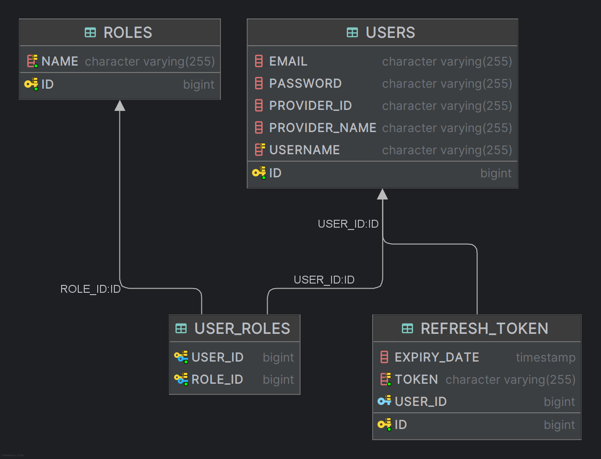

# Spring Security JWT, Refresh token login, register with Credentials, OAuth2

## Prerequisite 
- Spring Boot: `3.4.x`
- Java 21
- Google Auth Platform/Clients
## Models

## Authentication Flow
### a. Credentials (username/password)

### b. OAuth2 (Google Login)

### c. Refresh token flow

## Enpoints

| API Endpoint           | Method | Description                 | Body / Parameters                                                                 |
|------------------------|--------|-----------------------------|-----------------------------------------------------------------------------------|
| `/api/auth/register`   | POST   | Register with username/password | JSON: `{ "username": "abc", "email": "email@gmail.com", "password": "123456" }` |
| `/api/auth/login`      | POST   | Login with username/password | JSON: `{ "username": "abc", "password": "123456" }`                             |
| `/api/auth/refresh`    | POST   | Get new access token         | Query Param: `refreshToken=...`                                                |
| `/secured`             | GET    | Secured API (requires auth)  | Header: `Authorization: Bearer <access_token>`                                 |
| `/api/auth/google`     | GET    | Redirect to Google Login     | None                                                                               |

---

